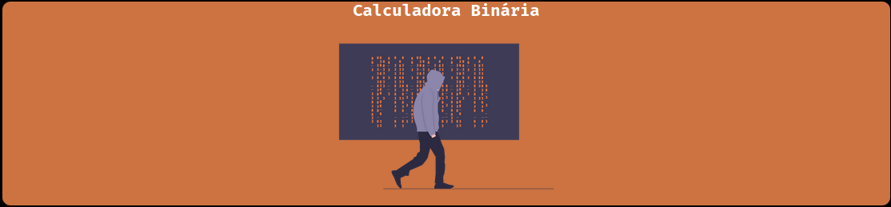
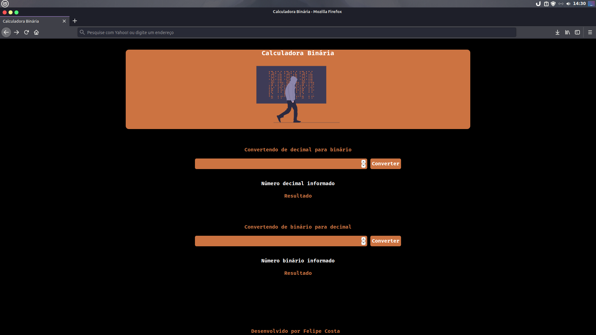
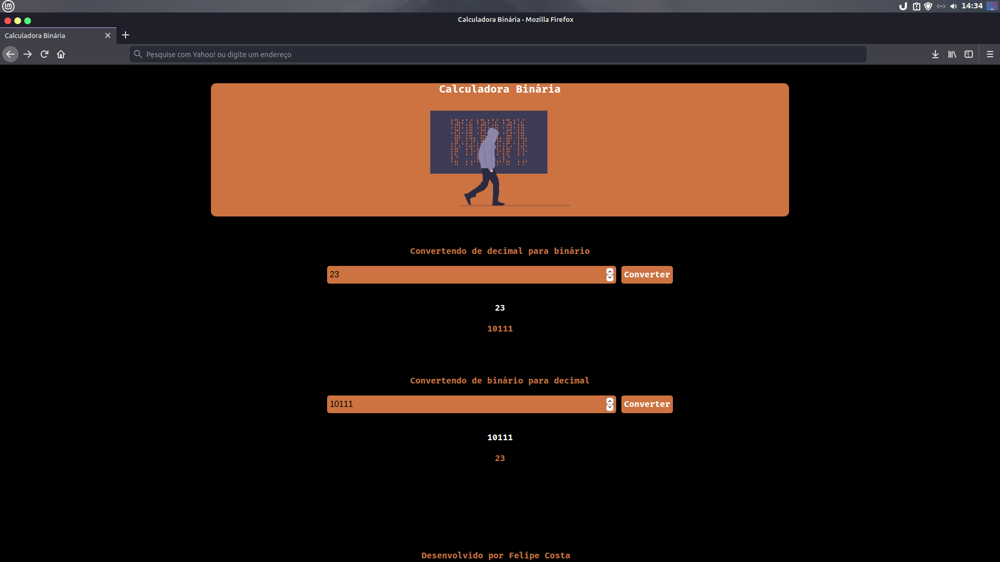

  
<h1 align="center">Calculadora Binária</h1>
<h3 align="center">Portifólio 💻</h3>

Site de conversão de números decimais para binário e binário para decimal.

Este projeto além de enriquecer meu portifólio, visa encontrar de maneira rápida a conversão de números decimais e binario. Em poucos segundos o usuário obtem o valor que deseja tanto em decimal quanto binário.

  

A primeira imagem mostra a tela inicial do site. O mesmo tem duas opções: Converter de decimal para binário e de binário para decimal.

  

A segunda imagem mostra o resultado dos números que o usuário digitou. Note que na primeira opção ele converteu o número decimal 23 para binário e na segunda opção ele converteu 10111 para decimal. Perceba que na cor branca é mostrado o número que o usuário digitou e na cor laranja é mostrado o resultado do número digitado.

  
<h2 align="center">Aplicação concluída 🚧</h2>

Aplicação onde coloquei os conhecimentos que adquiri em: Javascript, HTML e CSS  durante meu período de estudos.

<h2 align="center">Tecnlogias 🖇️</h2>
<h3 align="center">Tecnologias utilizadas nesse projeto</h3>
  

🔨 HTML

🔨 Javascript

🔨 CSS

🔨 Bootstrap

  
<h1 align="center">Desenvolvido por Felipe Costa</h1>